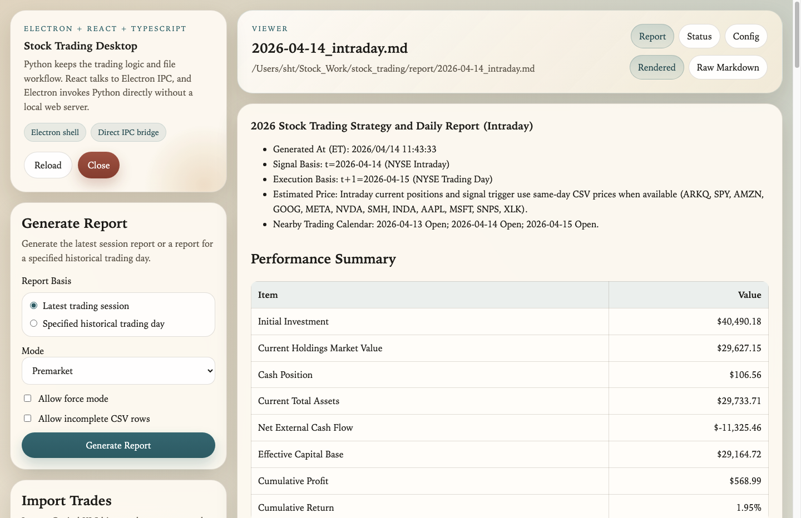
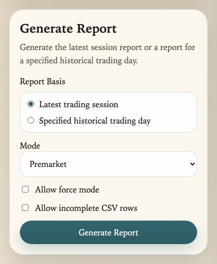
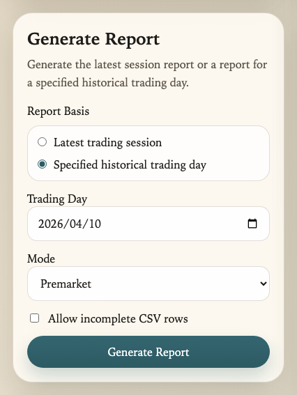
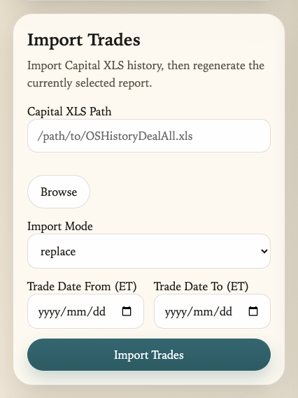
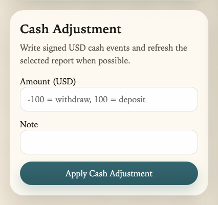
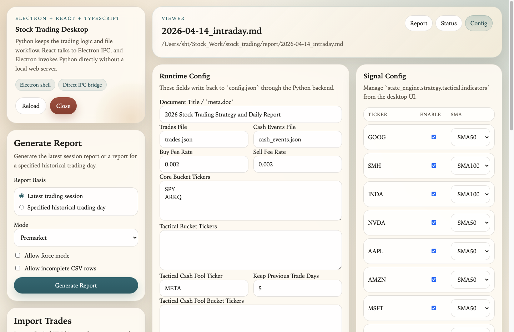
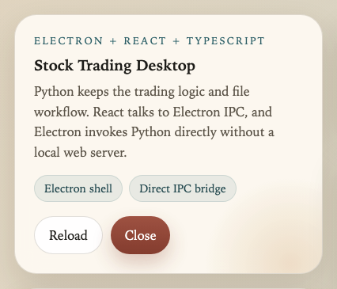

# Stock Trading System User Manual

The purpose of this document is as follows:

- Explain clearly when the system will buy, sell, or add to an existing position.
- Explain how each field in the report is calculated.
- Identify the commands used in routine operation, and the parameters that affect cash, trade records, and report outputs.
- Clarify which operations must be invoked with `--mode` and which may be executed without it.

------

## 1. Local GUI

The project now includes an Electron desktop GUI for routine operation. The desktop shell is built with `React + TypeScript + Electron`, and Electron calls the local Python trading logic directly through IPC-backed process execution. There is no browser dashboard and no local GUI HTTP server in the new path.

### 1.1 Start the GUI

If you want to install the desktop dependencies explicitly once:

```bash
cd desktop
npm install
```

Recommended:

```bash
python3 gui_app.py
```

This launches the Electron desktop app. If `desktop/node_modules` is missing, `gui_app.py` will run `npm install` automatically. If the production build is missing, it will also build `desktop/dist/` and `desktop/dist-electron/` before starting.

For active frontend development:

```bash
python3 gui_app.py --dev
```

This starts renderer watch builds and the Electron shell together. `gui_app.py` also exports the current Python interpreter through `PYTHON`, so the Electron process can start the matching local backend environment.

If you want to force a clean desktop rebuild first:

```bash
python3 gui_app.py --rebuild
```

The desktop execution chain is:

- React renderer in `desktop/src/`
- Electron main process in `desktop/electron/main.ts`
- JSON/stdin bridge in `gui_ipc.py`
- desktop action layer in `gui/desktop_backend.py`
- trading logic and file operations in `gui/services.py`

This means frontend contributors can work inside the `desktop/` workspace, while the existing Python portfolio and report logic remains in the repository root.

To refresh all GUI screenshots referenced in this README from the latest desktop code, run:

```bash
./capture_readme_screenshots.sh
```

### 1.2 What the GUI currently covers

The current Electron GUI is centered on one left-side control rail and one right-side viewer. In routine use, it lets you:

- auto-load the latest available report when the app opens, then switch from `Recent Reports`
- generate a report from one unified `Generate Report` panel
- choose whether the report basis is the latest trading session or a specified historical trading day
- run `Premarket`, `Intraday`, or `AfterClose` for the latest trading session
- run `Premarket` or `AfterClose` for a specified historical trading day
- optionally enable `Allow force mode` only when the report basis is the latest trading session
- optionally enable `Allow incomplete CSV rows` when the current workflow tolerates partial CSV data
- import Capital XLS trade history with `replace` or `append`
- optionally limit Capital XLS imports to an ET trade-date range before `append` or `replace` is applied
- record external cash deposits or withdrawals with a signed USD amount and a single-line note
- regenerate the currently selected report automatically after imports, cash adjustments, or config changes when the target report can be identified
- edit live runtime settings in the `Config` tab, including ledger paths, fee rates, buckets, FX pairs, trading calendar entries, numeric precision, and tactical indicators
- inspect the latest operation status, command, exit code, report path, log path, and captured log output
- multi-select recent reports with checkboxes, `Select All` / `Deselect All`, and `Delete All Selects`
- reload or close the desktop app directly from the GUI

### 1.3 Main screen layout

The current GUI layout is shown below. This screenshot reflects the new Electron desktop shell and its current control flow.

<p>
  
</p>

Read it as follows:

- the left control rail is where routine actions happen: `Generate Report`, `Import Trades`, `Cash Adjustment`, and `Recent Reports`
- the upper-left hero card contains app-level actions: `Reload` and `Close`
- the right workspace has three tabs:
  - `Report`: rendered markdown or raw markdown
  - `Status`: the latest command result and captured logs
  - `Config`: structured runtime and signal configuration forms

  For quick orientation:

| Area | What it is for |
| --- | --- |
| `Generate Report` | Generate the latest report or a historical report from one form |
| `Import Trades` | Import Capital XLS history and refresh the selected report |
| `Cash Adjustment` | Record deposits or withdrawals as signed USD cash events |
| `Recent Reports` | Switch the viewer target, select many reports, or delete generated artifacts |
| `Report` tab | Read the selected markdown report |
| `Status` tab | Confirm what command ran, whether it succeeded, and what it logged |
| `Config` tab | Edit `config.json` through grouped forms instead of raw JSON editing |

### 1.4 Generate a report

The report workflow is no longer split between a separate "daily run" panel and a separate "generate report" panel. The GUI now exposes one `Generate Report` form, and the only high-level choice is whether you want:

- the latest trading session
- a specified historical trading day

| Latest Trading Session | Specified Historical Trading Day |
|:--:|:--:|
|  |  |


Use the panel this way:

1. Choose `Report Basis`.
2. If you choose `Latest trading session`, the form can run `Premarket`, `Intraday`, or `AfterClose`, and `Allow force mode` is available.
3. If you choose `Specified historical trading day`, the form reveals `Trading Day`, hides `Allow force mode`, and removes `Intraday` from the mode list because intraday is only meaningful for the live/latest session.
4. Choose the target `Mode`.
5. If needed, enable `Allow incomplete CSV rows`.
6. Click `Generate Report`.
7. Review the result in the `Report` tab. If anything looks wrong, switch to `Status` to inspect the exact command, exit code, and logs.

Practical examples:

- If you want the current premarket report before the market opens, use `Latest trading session` + `Premarket`.
- If you want to regenerate a report for `2026-04-10`, use `Specified historical trading day`, pick `2026-04-10`, then choose `Premarket` or `AfterClose`.
- If you accidentally switch to historical mode while `Intraday` was selected, the GUI automatically moves you back to a valid historical mode.

### 1.5 Import trades, cash adjustments, and recent reports

These three panels live under the report form in the same left rail, and together they cover most routine maintenance work.

**Import Trades**

<p>
  
</p>

1. Paste a local `OSHistoryDealAll.xls` path, or click `Browse`.
2. Choose `replace` for a full rebuild from broker history, or `append` for incremental imports.
3. Optionally bound the import with `Trade Date From (ET)` and `Trade Date To (ET)`.
4. Click `Import Trades`.
5. Inspect `Status` first, then return to `Report` to confirm the refreshed output.

**Cash Adjustment**

<p>
  
</p>

1. Enter a signed USD amount in `Amount (USD)`.
2. Use negative values for withdrawals and positive values for deposits.
3. Add a short single-line note, for example `capital withdrawal` or `manual deposit`.
4. Click `Apply Cash Adjustment`.

**Recent Reports**

1. Click a report row to load it into the viewer.
2. Use the checkbox beside each row when you want to delete multiple generated reports.
3. `Select All` becomes `Deselect All` when every visible report is selected.
4. `Delete All Selects` removes the selected markdown reports and their matching JSON artifacts.

### 1.6 Config tab

The `Config` tab is intended to replace direct `config.json` editing for routine changes. It preserves the existing backend structure, but exposes it as grouped forms so the most frequently adjusted parameters can be edited safely from the desktop app.

<p>
  
</p>

The `Config` tab currently covers:

- document metadata and ledger paths
- buy-side and sell-side execution fee rates
- bucket defaults for core, tactical, and tactical cash-pool tickers
- FX aliases and per-ticker CSV overrides
- trading-calendar closures and early closes
- numeric precision and trade-render policy
- tactical indicator selection in the `Signal Config` section

Recommended usage:

1. Open `Config`.
2. Edit the relevant grouped fields instead of editing raw JSON by hand.
3. Click `Save Runtime Config` or `Save Signal Config`.
4. Review the `Status` tab if the save fails, or return to `Report` if you want to inspect the refreshed output.

### 1.7 Reload and close the GUI

The app-level controls are exposed in the upper-left hero card:

<p>
  
</p>

Use them as follows:

- `Reload`: restart the Electron desktop app and reconnect the session. Use this after frontend or backend code changes when you want the app to rebuild and reopen without manually re-running `python3 gui_app.py`.
- `Close`: exit the desktop app completely.

### 1.8 Current GUI limitations

The current GUI is intentionally focused on routine workflows. A few tasks are still better handled from the CLI:

- initializing an empty runtime directory from scratch still requires creating the local runtime files once
- direct cash-only operations such as `--initial-investment-usd` and `--cash-transfer-to-reserve-usd` are not yet exposed in the GUI
- broker reconciliation arguments such as `--broker-investment-total-usd` are still CLI-first
- the GUI operates on the same local `config.json`, `states.json`, `trades.json`, `data/`, and `report/` files as the CLI

### 1.9 Recommended daily usage flow

For routine use, the intended order is:

1. Start the GUI.
2. Let the auto-loaded latest report open, or switch to another report from `Recent Reports`.
3. Use `Generate Report` for the latest trading session or for a specific historical trading day.
4. If you imported new broker trades, use `Import Trades` and let the GUI regenerate the selected report automatically.
5. If you recorded a deposit or withdrawal, confirm the result in `Status`, then inspect the refreshed report.
6. Use `Config` only when you need to change runtime behavior, calendar data, precision, or tactical signal settings.

------

## 2. How to initialize a portfolio and current positions

This section describes how to bootstrap local runtime state when you want the system to start from an existing broker portfolio rather than from incremental daily updates.

### 2.1 What is actually being initialized

Initialization is centered on two local runtime files:

- `states.json`: persistent portfolio state such as holdings quantities, cash buckets, and performance basis
- `trades.json`: the transaction ledger used to rebuild holdings and FIFO cost basis

The current positions shown in reports are not entered manually as a separate source of truth. Instead, they are rebuilt from the trade ledger. In practice, the cleanest bootstrap is:

1. prepare a complete local trade history
2. import it with `replace`
3. let the system rebuild positions from that ledger

### 2.2 Prepare the local runtime files if you are starting from zero

`update_states.py` expects the state file to exist. If this is a brand-new local setup, create the runtime files once:

```bash
printf '{}\n' > states.json
printf '[]\n' > trades.json
```

Also confirm that the following project files and directories already exist and are correct for your environment:

- `config.json`
- `data/`
- `report_spec.json`

### 2.3 Recommended path: initialize from a full Capital XLS export in the GUI

This is the simplest path when your broker export is available as Capital Securities `OSHistoryDealAll.xls`.

1. Start the GUI with `python3 gui_app.py`.
2. Open the `Import Trades` panel.
3. Upload the full broker export, or provide its local file path.
4. Keep `Import Mode` as `replace` for the first bootstrap.
5. Leave `Trade Date From (ET)` and `Trade Date To (ET)` blank for a full-history bootstrap. Only fill them when you intentionally want to import a bounded date window.
6. Submit the import.
7. Review the `Status` tab for success, then inspect the regenerated report.

For a first-time bootstrap, do not use a partial XLS export. Use the full available trading history so the rebuilt holdings, share counts, and FIFO lots match the broker ledger.

### 2.4 Equivalent CLI path: initialize from a full Capital XLS export

If you prefer the CLI, the equivalent bootstrap command is:

```bash
./update_xml.sh /path/to/OSHistoryDealAll.xls \
  --states states.json \
  --out states.json \
  --config config.json \
  --trades-file trades.json \
  --trades-import-mode replace
```

This converts the Capital XLS export into normalized trades and then rebuilds `trades.json` and `states.json` from that imported ledger.

### 2.5 Alternative CLI path: initialize from a normalized imported trades JSON

If you already have normalized imported trades JSON from another source, you can bootstrap directly through `update_states.py`:

```bash
python3 update_states.py \
  --states states.json \
  --out states.json \
  --config config.json \
  --trades-file trades.json \
  --imported-trades-json /path/to/imported_trades.json \
  --trades-import-mode replace
```

Use this path only if the imported JSON already follows the system's normalized trade schema.

### 2.6 Set the initial investment baseline if you want return metrics

If you want profit and return calculations in the report to reflect your intended baseline, record the initial investment amount explicitly:

```bash
python3 update_states.py \
  --states states.json \
  --out states.json \
  --config config.json \
  --trades-file trades.json \
  --initial-investment-usd 100000
```

This step is optional for position reconstruction, but recommended if you want `profit_usd` and `profit_rate` to be meaningful from day one.

### 2.7 Generate the first report and validate the rebuild

After the trade ledger has been imported, generate a report and validate the rebuilt portfolio:

```bash
python3 generate_report.py \
  --states states.json \
  --config config.json \
  --trades-file trades.json \
  --schema report_spec.json \
  --mode Premarket \
  --out-dir report
```

Check the following before you trust the initialized portfolio:

- current positions match the broker's share quantities
- tickers introduced by the imported ledger are present in the report
- current-position notes reflect the surviving FIFO lots you expect
- cash buckets and total assets are plausible
- no missing-price or incomplete-CSV errors appear in the generated status log

------

## 3. Core operation of the strategy

The system performs four tasks each day:

1. Read the latest market price data.
2. Re-evaluate whether each tactical stock still satisfies the buy criteria.
3. Determine the recommended action for the next day, or the next trading session.
4. Generate a report listing positions, cash, signals, thresholds, and trade details.

### Core strategic concept

Each tactical stock is evaluated using two signals:

1. Whether the closing price is above its moving average

$$
Close(t) > MA(t)
$$

1. Whether the closing price is above the closing price from 5 trading days earlier

$$
Close(t) > Close(t-5)
$$

A Buy signal is considered valid only when both conditions are satisfied.

------

## 4. How buy, sell, and add-on decisions are made

### 4.1 Buy rule

A stock becomes eligible for purchase if both of the following conditions hold:

- `Close(t) > MA(t)`
- `Close(t) > Close(t-5)`

### 4.2 Sell rule

If a tactical stock is currently held, but its Buy signal is no longer valid, the system action is:

- `SELL_ALL`

At present, the strategy does not support partial reductions or staged exits. Once the signal fails, the entire tactical position is exited.

### 4.3 Add-on rule

As long as a stock has a valid Buy signal, it participates in the current capital allocation cycle, regardless of whether it is:

- not currently held, or
- already held

Accordingly, three positive actions may result:

- `BUY`: not previously held, and allocated shares in this round
- `BUY_MORE`: already held, and allocated additional shares in this round
- `HOLD`: already held, but no additional shares were allocated in this round

------

## 5. How cash is partitioned: deployable cash vs reserve cash

The system divides cash into two categories:

| Type            | Field            | Can be used to buy stocks | Included in total assets |
| --------------- | ---------------- | ------------------------- | ------------------------ |
| Deployable cash | `deployable_usd` | Yes                       | Yes                      |
| Reserve cash    | `reserve_usd`    | No                        | Yes                      |

Total cash is always defined as:

```text
cash.usd = deployable_usd + reserve_usd
```

### 5.1 Which funds go into deployable cash

The following cash flows are routed to `deployable_usd` by default:

- cash proceeds recovered from stock sales
- capital injection or external deposit
- tactical cash inferred from trade history

These funds are therefore treated, by default, as capital available for redeployment into the market.

### 5.2 What reserve cash means

`reserve_usd` is cash intentionally set aside and excluded from the next buy cycle.

It:

- remains part of total assets
- is still included in NAV
- does not participate in tactical buy allocation

### 5.3 Internal transfers: deployable cash <-> reserve cash

The following parameter may be used:

```bash
--cash-transfer-to-reserve-usd <amount>
```

Transfer rules:

- positive value: transfer from `deployable_usd` to `reserve_usd`
- negative value: transfer from `reserve_usd` back to `deployable_usd`

Examples:

- `--cash-transfer-to-reserve-usd 5000`
  means transferring USD 5,000 of deployable cash into reserve cash
- `--cash-transfer-to-reserve-usd -3000`
  means transferring USD 3,000 of reserve cash back into deployable cash

### 5.4 Safety checks

The system performs boundary checks:

- if the positive transfer amount exceeds `deployable_usd`, execution aborts immediately
- if the absolute value of a negative transfer exceeds `reserve_usd`, execution aborts immediately

Upon abort:

- `states.json` is not updated
- no report is generated
- no partial output is left behind

In other words, the entire run is rolled back to its pre-execution state.

------

## 6. How share quantities are allocated for purchases

### 6.1 Which stocks are included in the current allocation round

A stock enters the set of buy candidates if:

- `buy_signal = true`, and
- a valid price is available, meaning `action_price_usd > 0`

This includes:

- stocks not currently held, representing new entries
- stocks already held, representing add-on allocations

### 6.2 Which cash bucket is used

Only the following cash bucket is used in the current purchase allocation round:

- `deployable_usd`

`reserve_usd` does not participate in stock purchases.

In addition, if `SELL_ALL` actions exist in the same round, the system performs a simple estimate and adds projected sale proceeds into the buy funding pool:

```text
estimated_sell_reclaim_usd = Sigma(sold_shares x action_price_usd)
investable_cash_usd = investable_cash_base_usd + estimated_sell_reclaim_usd
```

This estimate is used only for purchase allocation within the current round.

### 6.3 Allocation flow

The allocation logic for `BUY` and `BUY_MORE` does not use `Close(t)` directly. Instead, the per-share purchase cost is scaled to include fees:

```text
buy_sizing_price_usd = Close(t) x (1 + fee_rate)
```

That is, the allocator uses the fee-inclusive per-share cost.

#### Phase A: ensure at least 1 share per selected stock

If capital is sufficient, the system first ensures that each selected stock receives at least 1 share.

If capital is insufficient to buy 1 share of every selected stock:

- stocks are sorted from lowest price to highest price
- only the cheapest affordable prefix set is retained

Operationally, this means that when capital is insufficient to establish an initial position in every candidate, priority is given to the lowest-priced eligible names.

#### Phase B: split remaining cash evenly

After Phase A, the remaining deployable cash is divided equally across the selected stocks.

For each stock, the system computes how many additional shares can be purchased and rounds down to an integer number of shares.

#### Phase C: repeatedly deploy the remainder into the most expensive affordable stock

After equal allocation, if residual cash remains, the system will:

- in each round, identify the most expensive stock that is still affordable
- buy 1 additional share
- repeat
- continue until no stock is affordable anymore

This is intended to utilize `deployable_usd` as efficiently as possible.

------

## 7. How `mode`, snapshots, and `states.json` are now separated

### 7.1 `states.json` no longer stores the selector

`states.json` no longer stores selector-style fields such as:

- `meta.mode`
- `meta.active_mode`
- `meta.last_run`

That means the state file no longer persists which mode is currently active.

### 7.1.1 Responsibility split among `states.json`, `config.json`, and `trades.json`

Trade details are now externalized into `trades.json` by default:

- `config.json` retains runtime configuration only, grouped under `state_engine.meta`, `state_engine.execution`, `state_engine.portfolio`, `state_engine.strategy`, `state_engine.data`, and `state_engine.reporting`
- `states.json` retains compact persistent state such as holdings quantities, cash baselines, external cash-flow history, and performance basis, and no longer stores `meta.trades_file` or `meta.trades_count`
- `trades.json` retains transaction-level trade records
- `report/<DATE>_<mode>.json` retains the fully assembled mode-specific report snapshot used to render markdown output

In addition, historical price data is now loaded directly from `data/*.csv` on each execution, rather than storing a long-lived OHLCV block such as `history_400d` inside `states.json`. This includes configured FX pairs such as `state_engine.fx_pairs.usd_twd -> TWD=X`, which are downloaded alongside equity CSVs and can be used for report-only currency analytics.

Also, `states.json` no longer embeds a `config` block and no longer stores `market.csv_sources`, `meta.doc`, `meta.timezone`, `meta.trades_file`, or `meta.trades_count`. These are loaded from external `config.json` at runtime.

Numeric rounding policy is fully configuration-owned as well. `state_engine.reporting.numeric_precision` now centralizes:

- `usd_amount` for persisted cash and other USD runtime amounts
- `display_price` and `display_pct` for rendered output
- `trade_cash_amount` and `trade_dedupe_amount` for imported trades before they are merged into `trades.json`
- `state_selected_fields` for persisted rounded fields in `states.json`
- `backtest_amount`, `backtest_price`, `backtest_rate`, and `backtest_cost_param` for backtest output

### 7.2 Mode context is derived at runtime

Mode-specific report context is no longer persisted in `states.json`.

Fields such as:

- `signal_basis`
- `execution_basis`
- `version_anchor_et`
- `by_mode.*`

are now treated as transient runtime metadata derived from:

- the explicit `--mode`
- the current ET session, or an explicit report date when applicable
- the configured trading calendar

Likewise, `signals`, `thresholds`, `market.signals_inputs`, and `market.next_close_threshold_inputs` are no longer persisted. These are now treated as transient data computed on demand during report rendering.

`states.json` now primarily retains:

- current holdings quantities: `portfolio.positions[*].ticker`, `portfolio.positions[*].shares`
- persistent cash state: `portfolio.cash.usd`, `portfolio.cash.deployable_usd`, `portfolio.cash.reserve_usd`, `portfolio.cash.baseline_usd`, external cash-flow history, and related reconciliation metadata
- persistent performance basis: `portfolio.performance.initial_investment_usd` and `portfolio.performance.baseline.*`

Derived fields such as market prices, totals, signals, thresholds, and per-mode report content are not persisted in `states.json`. Runtime performance outputs such as current total assets and profit are recomputed from the persistent basis plus the latest `trades.json` and `data/*.csv`, then written into `report/<DATE>_<mode>.json` for each mode run.

### 7.3 Why all reports now require an explicit `--mode`

Because the state no longer stores the selector or mode snapshot, any path that generates a report must explicitly specify:

```bash
--mode Premarket
--mode Intraday
--mode AfterClose
```

The report will then derive the corresponding runtime context directly rather than relying on a stale last-used mode stored in state.

------

## 8. How to use the main CLI entry points

### 8.1 Premarket

```bash
./premarket.sh
```

Purpose: update the state before market open and generate the premarket report.
Current-position USD prices and signal inputs stay on the prior NYSE close. `Unrealized PnL (TWD)` still uses the latest available USD/TWD CSV quote and the report marks that as `Estimated Price`.
This entry point does not rewrite the primary `states.json`. It writes `report/<DATE>_premarket.json` and renders the markdown report from that snapshot.

### 8.2 Intraday

```bash
./intraday.sh
```

Purpose: update the state during market hours and generate the intraday report.
If a same-day CSV row is available, `Current Positions` and `Signal Status` use that same-day price in Intraday mode, and the report marks it as `Estimated Price`.
This entry point does not rewrite the primary `states.json`. It writes `report/<DATE>_intraday.json` and renders the markdown report from that snapshot.

### 8.3 AfterClose

```bash
./afterclose.sh
```

Purpose: update the state after market close and generate the after-close report.
This entry point does not rewrite the primary `states.json`. It writes `report/<DATE>_afterclose.json` and renders the markdown report from that snapshot.

### 8.4 Capital XLS extension import

```bash
./update_xml.sh <capital-xls-path> [extra update_states args...]
```

Purpose: run the Capital Securities importer extension, convert `OSHistoryDealAll.xls` into normalized trades JSON, and then call `update_states.py` to synchronize `trades.json` and `states.json`.

This entry point:

- does not require `--mode`
- does not require explicit `--csv-dir`
- if `--csv-dir` is omitted, price CSV files are automatically loaded from `./data`
- preserves `update_states.py` import behavior: default is `append`, and `--trades-import-mode replace` means overwrite rather than merge
- supports `--trade-date-from YYYY-MM-DD` and `--trade-date-to YYYY-MM-DD` to filter imported XLS rows before they are converted into normalized trades
- when `--trades-import-mode replace` is used without a date range, the system clears the existing trade ledger first, then inserts the imported rows
- when `--trades-import-mode replace` is combined with a trade-date filter, the system first removes every existing trade whose `trade_date_et` falls inside that bounded range, then inserts the filtered incoming rows
- if the filtered incoming batch is empty, `replace` still clears the existing trades inside that bounded range

### 8.5 Generate a report only

```bash
python3 generate_report.py --states states.json --trades-file trades.json --schema report_spec.json --mode Premarket
```

Purpose: use an existing snapshot together with `data/*.csv` to compute the tactical plan on demand and generate the report for the specified mode.

This command must explicitly include `--mode`.
When `update_states.py` is run with `--mode`, it now attempts an automatic CSV refresh first. The refresh scope is limited to functionally active tickers: current holdings, strategy tickers, and configured FX pairs such as `TWD=X`. The mode update flow refreshes those active tickers every time and downloads CSV history through the current ET date. Mode semantics are enforced later when the report or state snapshot chooses which ET row to use. For example, `Premarket` still reads the prior NYSE close for equity pricing and signals, while `Intraday` can use the same-day row when available. The underlying download logic is handled by `download_1y.py` — see [Section 18.1](#181-download_1ypy--historical-data-downloader) for advanced usage and manual invocation.
If the input `states.json` is compact, the command reconstructs derived position fields such as bucket and FIFO cost basis from `trades.json` before loading CSV market data.
If a downloaded or local CSV row has incomplete OHLC values, the command fails by default. Use `--allow-incomplete-csv-rows` only when you intentionally want to bypass that failure and skip incomplete rows.

### 8.6 Tactical simulation / backtest

```bash
python3 backtest.py --config backtest_config.json --csv-dir data --out-dir backtest
```

Purpose: simulate historical strategy performance using OHLCV data.

Currently implemented rules:

- supports `--strategy tactical` and `--strategy mean-reversion`
- by default uses the most recent `252` trading days, plus the required warm-up window
- supports `--lookback-trading-days`
- supports `--start-date` and `--end-date`
- tactical strategy initial capital defaults to `backtest.tactical.starting_cash`, but can be overridden using `--starting-cash`
- mean-reversion strategy initial capital defaults to `backtest.mean_reversion.starting_cash_per_ticker`, but can be overridden using `--starting-cash` or `--mr-starting-cash-per-ticker`
- all backtest fills are executed at `t+1`
- the `t+1` execution price is `(Open(t+1) + Close(t+1)) / 2`
- net results incorporate `backtest.costs.fee_rate`, `backtest.costs.commission_per_trade`, and `backtest.costs.slippage_bps`
- tactical markdown output compares strategy against a "buy-and-hold from initial date without selling" benchmark
- mean-reversion markdown output lists aggregate results and per-ticker results without a benchmark section

### 8.6.1 All-in-one shell script

```bash
./backtest_all_in_one.sh --starting-cash 100000 --start-date 2025-03-01 --end-date 2026-03-01 --out-dir backtest_phase2
```

This script performs more than report generation alone. It will:

1. accept the provided parameters
2. run the backtest simulation
3. output `summary`, `equity_curve`, and `trades`
4. generate `report.md` at the end

If `--out-dir` is not specified, the system automatically creates a timestamped directory.

Backtest-specific parameters are grouped under `backtest_config.json.backtest`:

- `default_strategy`
- `lookback_trading_days`
- `starting_cash`
- `costs.fee_rate`
- `costs.commission_per_trade`
- `costs.slippage_bps`
- `tactical.starting_cash`
- `tactical.tickers`
- `tactical.indicators`

Mean-reversion parameters are stored under `backtest_config.json.backtest.mean_reversion`:

- `entry_drawdown_pct`
- `take_profit_pct`
- `stop_loss_pct`
- `starting_cash_per_ticker`
- optional `tickers`

The corresponding CLI overrides are:

- `--mr-entry-pct`
- `--mr-take-profit-pct`
- `--mr-stop-loss-pct`
- `--mr-starting-cash-per-ticker`
- `--mr-tickers`

Mean-reversion semantics:

- each ticker is backtested independently
- entry trigger uses `close(T) / close(day0) - 1 <= -entry_drawdown_pct`
- take-profit trigger uses `close(T) / close(day0) - 1 >= take_profit_pct`
- stop-loss trigger uses `close(T) / entry_price - 1 <= -stop_loss_pct`
- after each actual fill, `day0` resets to the execution day `T+1` close

Period and capital parameters:

- `--starting-cash`
  - overrides the strategy-specific starting cash from `backtest_config.json.backtest`
- `--lookback-trading-days N`
  - when `--start-date` is not specified, backtests the most recent `N` trading days
  - if `--end-date` is also specified, that date is used as the backward anchor
- `--start-date YYYY-MM-DD`
  - specifies the inclusive start date
  - once specified, `--lookback-trading-days` no longer applies
- `--end-date YYYY-MM-DD`
  - specifies the inclusive end date
  - if omitted, defaults to the last date in the shared trading calendar
  - if the date range falls outside the shared trading calendar, or if there are not enough warm-up trading days before `start-date`, the program fails directly rather than auto-shrinking the window

  Output files:

- `summary.json`
- `equity_curve.csv`
- `gross_trades.json`
- `net_trades.json`
- `report.md`

------

## 9. How to read the report

### 9.1 Buy and sell trigger status table

This is the primary table for day-to-day decision-making.

| Field                           | Meaning                      | Description                                   |
| ------------------------------- | ---------------------------- | --------------------------------------------- |
| Symbol                          | Ticker                       | For example, GOOG or NVDA                     |
| A: Price (Now)                  | Price used by signal checks  | `Close(t)` in Premarket / AfterClose; current price in Intraday |
| MA rule                         | Moving-average rule          | For example, SMA50 or SMA100                  |
| B: SMA(t)                       | Current moving average value | Computed according to the rule for that stock |
| C: Close(t-5)                   | Close 5 trading days ago     | Always participates in Buy evaluation         |
| A>B                             | Above moving average         | TRUE or FALSE                                 |
| A>C                             | Above close from 5 days ago  | TRUE or FALSE                                 |
| BUY signal                      | Final signal status          | TRUE or FALSE, defined by `A>B && A>C`        |
| Tactical shares (pre-execution) | Shares held before execution | Tactical bucket only                          |
| t+1 action                      | Recommended next action      | BUY, BUY_MORE, HOLD, SELL_ALL, or NO_ACTION   |
| Action shares                   | Recommended order quantity   | 0 if no action is needed                      |

### 9.2 How `A>B` is computed

When:

```text
A > B
```

the field is shown as `TRUE`; otherwise `FALSE`.

### 9.2.1 How `A>C` is computed

When:

```text
A > C
```

the field is shown as `TRUE`; otherwise `FALSE`.

### 9.3 Final determination of the Buy signal

```text
buy_signal = (Close(t) > MA(t)) and (Close(t) > Close(t-5))
```

Sell determination:

```text
sell_signal = (shares_pre > 0) and (not buy_signal)
```

If Sell is true, then `t+1_action = SELL_ALL`.

### 9.3.1 Row ordering in `Signal Status`

The `Signal Status` table is ordered by `B-A`, from largest to smallest:

```text
B-A = SMA(t) - Price(Now)
```

This means the report places the stocks that are farthest below their moving average near the top of the table.
If two rows have the same `B-A`, ticker symbol is used as the tie-breaker in ascending order.

### 9.4 How the `t+1 Hypothetical Trigger Close Threshold (P_min)` table is read

This threshold table is used to answer a different question from `Signal Status`: what next close would be required to satisfy the tactical buy rule on `t+1`.

| Field                                  | Meaning |
| -------------------------------------- | ------- |
| `SMA-Equivalent Threshold (strict >)`  | The minimum next close implied by the moving-average side of the rule |
| `P_min (strict >)`                     | The stricter of the moving-average threshold and the `Close(t-5)` threshold |
| `Display`                              | The preformatted display string for `P_min`, shown with a trailing `+` |

The system computes:

```text
threshold_from_ma = SUM_{n-1} / (window - 1)
P_min = max(threshold_from_ma, Close(t-5))
```

Accordingly, when `threshold_from_ma >= Close(t-5)`, the `SMA-Equivalent Threshold` column and the `P_min` column will be identical by design.

------

## 10. How other report fields are computed

### 10.1 Current position status table

The report only displays stocks with `shares > 0`.

Positions that have been fully sold are now removed directly from `portfolio.positions`; zero-share remnants are no longer retained.

| Field              | Calculation                                         |
| ------------------ | --------------------------------------------------- |
| Market value       | `shares x price_now`                                |
| Unrealized PnL     | `market_value_usd - cost_usd`                       |
| Unrealized percent | `unrealized_pnl_usd / cost_usd`, blank if cost is 0 |

### 10.2 Total assets and NAV

```text
portfolio.nav_usd = total market value of all holdings + deployable_usd + reserve_usd
```

### 10.3 Return rate

If an initial invested amount has been defined:

```text
effective_capital_base_usd = initial_investment_usd + net_external_cash_flow_usd
profit_usd = current_total_assets_usd - effective_capital_base_usd
profit_rate = profit_usd / effective_capital_base_usd
```

------

## 11. Capital XLS extension behavior and new ticker handling

### 11.1 Capital XLS extension can run without `--mode`

This is intentionally supported because the extension ultimately feeds normalized trades into the core update flow, which can update trades, cash, and positions without recomputing a report mode.

### 11.2 If Capital XLS import introduces a new ticker, the system automatically creates the position

If the Capital XLS export contains a new buy for a stock that does not already exist in `portfolio.positions`, the system automatically creates that ticker entry.

### 11.3 CSV loading and price hydration happen within the same execution

As long as `./data/<TICKER>.csv` exists, the system will complete the following within the same Capital XLS import run:

- CSV import
- `price_now` update
- recomputation of market value and unrealized PnL

Accordingly, no second run is required. A newly imported ticker can be valued immediately within the same execution cycle.

------

## 12. Frequently used parameters

### 12.1 Data and output

| Parameter         | Purpose                                                      |
| ----------------- | ------------------------------------------------------------ |
| `--states`        | Specify the state file                                       |
| `--out`           | Specify the output state file                                |
| `--csv-dir`       | Specify the market price CSV directory; defaults to `./data` if omitted |
| `--allow-incomplete-csv-rows` | Bypass incomplete OHLC rows by skipping them instead of failing |
| `--report-json-out` | Explicitly specify the mode snapshot JSON path; default is `report/<DATE>_<mode>.json` |
| `--report-schema` | Specify the report schema                                    |
| `--report-dir`    | Specify the report output directory                          |
| `--report-out`    | Directly specify the report output filename                  |
| `--log-file`      | Specify the log file; if omitted, a file is automatically created under `logs/` |

### 12.2 Mode and reporting

| Parameter         | Purpose                                                      |
| ----------------- | ------------------------------------------------------------ |
| `--mode`          | Specify `Premarket`, `Intraday`, or `AfterClose`             |
| `--render-report` | Generate the report in the same execution flow after update  |
| `--now-et`        | Override the current ET timestamp for testing mode/session determination and report generation metadata |
| `-f`, `--force-mode`   | Bypass the ET/session check and run the requested `--mode` anyway |

### 12.3 Cash and performance

| Parameter                        | Purpose                                                      |
| -------------------------------- | ------------------------------------------------------------ |
| `--initial-investment-usd`       | Specify the initial invested capital                         |
| `--cash-adjust-usd`              | Record external deposit or withdrawal                        |
| `--cash-adjust-note`             | Note for external cash flow                                  |
| `--cash-transfer-to-reserve-usd` | Perform internal transfer between deployable and reserve cash |
| `--tactical-cash-usd`            | Reconcile tactical cash using broker cash snapshot           |

### 12.4 Reconciliation and validation

| Parameter                        | Purpose                                      |
| -------------------------------- | -------------------------------------------- |
| `--broker-investment-total-usd`  | Broker total holdings snapshot               |
| `--broker-investment-total-kind` | Reconcile against cost basis or market value |
| `--verify-tolerance-usd`         | Reconciliation tolerance                     |

### 12.5 Trade import

| Parameter              | Purpose               |
| ---------------------- | --------------------- |
| `--imported-trades-json` | Import normalized trades JSON generated by an external importer |
| `--trades-import-mode` | `append` or `replace` (default: `append`) |
| `--trade-date-from` | Lower ET trade-date bound for trade-import filtering and replace-range |
| `--trade-date-to` | Upper ET trade-date bound for trade-import filtering and replace-range |

Imported trade rounding is controlled by `config.json` under `state_engine.reporting.numeric_precision`. In practice, `trade_cash_amount` controls stored `cash_amount` values and `trade_dedupe_amount` controls the numeric precision used by trade deduplication keys.

`--trade-date-from` and `--trade-date-to` apply to trade-import flows such as the Capital XLS extension path and `update_states.py --imported-trades-json`. They filter imported rows before deduplication and before `append` or `replace` is evaluated.

Trade-import behavior is therefore:

- `append`: only the filtered incoming rows are appended
- `replace` without a date range: the existing trade ledger is cleared first, then the imported rows are inserted
- `replace` with a date range: every existing trade whose `trade_date_et` is inside the bounded range is deleted first, then the filtered incoming rows are inserted
- `replace` with an empty filtered batch: the bounded range is cleared and no replacement rows are inserted

In `append` mode, exact duplicates are still ignored. However, if an imported trade matches an existing trade identity by `trade_date_et + time_tw + ticker + side` but differs in values such as shares, gross, or fee, the import is treated as a conflict. In that case the run aborts, no state/trade files are written, and the GUI shows the failed operation in `Status`.

After imported trades are merged, `portfolio.positions` is rebuilt from the full trade ledger. Remaining position cost basis follows FIFO. This trade-ledger rebuild applies to holdings only; `market.prices_now` is rebuilt separately from loaded CSV history.
When `states.json` is saved, holdings are persisted as share quantities while cash baselines, external cash-flow history, and performance basis are also preserved; derived FIFO cost basis is reconstructed again on the next runtime from `trades.json`.
Current-position notes shown in reports are derived from the surviving FIFO lots behind each holding, aggregating the unique non-empty trade notes that still compose the remaining shares and appending the remaining share count for each note, such as `AA x2 | BB x7`. They are not persisted in `portfolio.positions`.
The `Current Positions` table also includes `Unrealized PnL (TWD)` and `Unrealized PnL % (TWD)`. They are computed only at report-build time by converting each surviving FIFO buy lot with the USD/TWD close on or before its buy date, then comparing that TWD cost basis with the current position market value translated by the latest available USD/TWD CSV quote. In Premarket mode the report marks that FX translation as `Estimated Price` whenever the FX quote is newer than the prior-close signal basis day.

### 12.6 When `--mode` is mandatory

- general daily update, signal recomputation, or report generation: required
- `--render-report`: must be used together with `--mode`
- Capital XLS extension import only: optional
- external cash adjustment only: optional
- deployable to reserve transfer only: optional
- initial investment update only: optional

When `--mode` is omitted, the system performs only state updates such as imported trades, cash adjustments, or initial investment updates.

It does not recompute report-scoped signals or thresholds, and it does not generate a report.

If `--mode` is present but the current ET session does not normally allow that mode, the command aborts by default. Use `-f` / `--force-mode` only when you intentionally want to run that mode anyway for backfill, testing, or manual scenario generation.

------

## 13. How log files work

### 13.1 `update_states.py` writes logs automatically

If `--log-file` is not explicitly specified, the system automatically creates:

```text
logs/update_states_<timestamp>_<pid>.log
```

### 13.2 `generate_report.py` also writes logs automatically

If `--log-file` is not explicitly specified, the system automatically creates:

```text
logs/generate_report_<timestamp>_<pid>.log
```

### 13.3 Contents of the logs

The log contains sufficient data for troubleshooting, for example:

- the actual command line
- working directory
- parsed parameters
- mode, ET time, and session determination
- which CSV files were imported
- imported trades result
- mismatch or abort reason
- report output path
- traceback

### 13.4 When the logs should be inspected

Logs should be reviewed first in situations such as the following:

- why the report was not generated
- why a mode was determined as invalid or unexpected
- why a ticker has no price
- why share count or cost basis after an importer run does not match expectation
- why a mismatch caused the run to abort

------

## 14. Routine operation examples

### 14.1 Standard premarket update

```bash
./premarket.sh
```

A routine daily update of this kind always includes `--mode`, and updates both the snapshot and the report for that mode.

### 14.2 Premarket update and move USD 3,000 into reserve cash

```bash
./premarket.sh --cash-transfer-to-reserve-usd 3000
```

### 14.3 Move USD 1,500 of reserve cash back into deployable cash

```bash
./premarket.sh --cash-transfer-to-reserve-usd -1500
```

### 14.4 After-close update and reconcile broker total holdings

```bash
./afterclose.sh --broker-investment-total-usd 40490.18
```

### 14.5 Import Capital XLS only, without `--mode`

```bash
./update_xml.sh data/OSHistoryDealAll.xls
```

### 14.6 Record an external deposit or withdrawal only, without `--mode`

```bash
python3 update_states.py --states states.json --out states.json --cash-adjust-usd 2000 --cash-adjust-note "top up"
```

### 14.7 Perform deployable and reserve transfer only, without `--mode`

```bash
python3 update_states.py --states states.json --out states.json --cash-transfer-to-reserve-usd 1500
```

### 14.8 Generate a report for a specific mode only

```bash
python3 generate_report.py --states states.json --schema report_spec.json --mode Intraday --out-dir report
```

If `states.json` is already a reduced snapshot, this command automatically loads CSV files from `./data` to reconstruct the buy/sell trigger table and threshold table required for reporting.

You may also specify `--csv-dir` explicitly.

### 14.9 Run a tactical simulation

```bash
python3 backtest.py --config backtest_config.json --csv-dir data --starting-cash 80000 --lookback-trading-days 120 --out-dir backtest_tactical
```

### 14.10 Run the independent mean-reversion backtest

```bash
python3 backtest.py --config backtest_config.json --csv-dir data --strategy mean-reversion --lookback-trading-days 252 --out-dir backtest_mean_reversion
```

### 14.11 Specify start and end dates and generate a markdown report

```bash
./backtest_all_in_one.sh --starting-cash 80000 --start-date 2025-01-01 --end-date 2025-12-31 --out-dir backtest_2025
```

### 14.12 Specify a custom log file path

```bash
python3 update_states.py --states states.json --out states.json --mode Premarket --csv-dir ./data --log-file logs/manual_premarket.log
```

------

## 15. Key operational points

1. The core Buy signal is: price above the moving average, and above the close from 5 trading days ago.
2. This strategy currently has no new-entry protection. If a position is held and the Buy signal fails, the `t+1` action is `SELL_ALL`.
3. Deployable cash is intended to be used as fully as possible. Reserve cash counts as an asset, but is not used to buy stocks.
4. A stock that is already held and still has a valid signal can also receive add-on allocation.
5. The report only displays current holdings with `shares > 0`.
6. Importer-driven trade updates and cash-related updates may be executed without `--mode`. General report and scenario updates must include it.
7. Standalone report generation always requires an explicit `--mode`.
8. Backtest now supports both `tactical` and `mean-reversion`. Tactical defaults to `backtest.tactical.starting_cash`; mean-reversion defaults to `backtest.mean_reversion.starting_cash_per_ticker`, and both can be overridden from the CLI.
9. Backtest can use `--lookback-trading-days`, or an explicit period via `--start-date` and `--end-date`.
10. The backtest report lists both strategy results and the "buy-and-hold from initial date without selling" benchmark.
11. If any result appears abnormal, inspect `logs/` first.

------

## 16. Test case overview

### 16.1 Run all tests with one command

```bash
./run_tests.sh
```

Current coverage includes the following:

- regression pipeline comparison of `update_states` plus `generate_report` against golden fixtures
- strategy and download utility function tests
- safety test ensuring report `row_computed` fields cannot be written back into state
- tactical signal tests and tests for folding projected sell proceeds into the buy cash pool
- backtest tests covering `t+1` execution, period selection, and markdown report generation

### 16.2 When fixtures should be refreshed

Whenever the following items are modified, `tests/fixtures/*golden*` should generally be refreshed:

- `state_engine` signal logic, cash allocation logic, or rounding output
- report schema or rendering behavior
- trade data structures or output formats for `states.json` or `trades.json`

### 16.3 Refresh regression fixtures with one command

```bash
./refresh_test_fixtures.sh
```

An optional custom time anchor may also be specified:

```bash
./refresh_test_fixtures.sh 2026-03-18T08:00:00-04:00
```

------

## 17. Versioning and changelog policy

- This project is formally designated as `v1.0.0` effective `2026-03-19`.
- From this point forward, whenever functionality, behavior, output format, or test baselines change, `CHANGELOG.md` must be updated.
- Any feature addition, removal, or behavior change must be reflected in `program.md` to keep documentation aligned with implementation.
- Any feature addition, removal, or behavior change must also be accompanied by the corresponding sanity tests or unit tests. Functionality changes without test coverage are not acceptable.
- At minimum, the following should be recorded:
  - Added / Changed / Fixed
  - whether a breaking change exists
  - which commands, fields, fixtures, and tests are affected

------

## 18. Utility scripts

These scripts handle supporting operations that are normally invoked automatically by the main entry points. Direct invocation is only needed for maintenance tasks, bulk re-downloads, or archiving.

### 18.1 `download_1y.py` — historical data downloader

`download_1y.py` fetches daily OHLCV history from Yahoo Finance and writes one CSV per ticker into the output directory. Under normal operation this script is called automatically whenever `update_states.py` runs with `--mode`; you do not need to invoke it manually for day-to-day use.

**When you might run it directly:**

- Seeding a fresh `data/` directory before the first mode run
- Re-downloading a wider date range than the automatic refresh covers
- Archiving a snapshot of the current CSVs as a zip file

**Basic usage**

```bash
python3 download_1y.py [options]
```

| Option | Default | Description |
|---|---|---|
| `--config PATH` | `config.json` | Config file used to derive the ticker list |
| `--tickers A,B,C` | _(from config)_ | Override the ticker list |
| `--output-dir PATH` | `data` | Directory to write CSV files |
| `--start YYYY-MM-DD` | 370 days before end | Inclusive start date |
| `--end YYYY-MM-DD` | yesterday | Inclusive end date |
| `--days-back N` | — | Set start to N days ago; overrides `--start` |
| `--zip` | off | Zip all output files into `{stamp_date}.zip` after a successful download |
| `--allow-incomplete-csv-rows` | off | Skip rows with incomplete OHLC data instead of failing |
| `--log-file PATH` | _(auto)_ | Override the log file path |

**Replicating the old `get_rec.sh` behaviour**

The shell script `get_rec.sh` (1 200-day range + zip) is now fully replaced by:

```bash
python3 download_1y.py --days-back 1200 --end $(date +%Y-%m-%d) --zip
```

The `--zip` flag reads the last date row of `GOOG.csv` to determine the archive name (`{stamp_date}.zip`), and falls back to `--end` if `GOOG.csv` is absent.
